<div align="center">




<br/>

[](https://amol-rakh.vercel.app/)
[](mailto:amolrakh22@gmail.com)
[](https://linkedin.com/in/amolrakha22)


</div>

<br/>



<br/>

## `#` about-me.sh

```yaml
role:        Full-Stack Developer & AI/ML Enthusiast
experience:  1 year professional (2 internships) · 7+ shipped projects
stack:       MERN · Flask/FastAPI · Docker · CI/CD · API-first design
focus:       AI chatbots · OCR/document-intelligence · civic & ed-tech systems
education:   B.E. AI & Data Science, Ajeenkya D.Y. Patil SOE, Pune — CGPA 8.06 (2026)
currently:   🔭 building AI-powered document intelligence & civic-tech platforms
             🌱 learning advanced backend & system design patterns
             🏆 latest win — Smart India Hackathon 2025, National 1st (₹1,50,000)
             💬 ask me about — React, Node.js, Flask, OCR/RAG pipelines
```

<br/>

<h2 align="center">🎉 Hacktoberfest 2025 - Open Source Contribution</h2>

[](https://holopin.io/@devamolrakh)

## `#` tech-stack.sh

<div align="center">

**Languages**
<br/>


**Frontend**
<br/>


**Backend & AI/ML**
<br/>


      

**Databases**
<br/>


**Cloud, DevOps & OS**
<br/>


**Tools**
<br/>


</div>

<details>
<summary align="center"><b>▸ expand full skill breakdown</b></summary>
<br/>

| Category | Skills |
|---|---|
| 🔧 **Backend** | Node.js (Express.js), Python (Flask/FastAPI), REST APIs, WebSockets, JWT/OAuth, SMTP, CI/CD |
| 🎨 **Frontend** | React.js, Vite, TypeScript, JavaScript (ES6+), Tailwind CSS, Bootstrap, Responsive Design |
| 🤖 **AI / Data Science** | NumPy, Pandas, Scikit-learn, OpenCV, Hugging Face, LLM APIs (Gemini, Groq, LLaMA), NLP, OCR, NER, RAG |
| 🗄️ **Databases** | PostgreSQL, MySQL, MongoDB (Atlas), Redis, Query Optimization, Data Modeling |
| ⚙️ **DevOps / Infra** | Docker, Kubernetes (basic), Jenkins, GitHub Actions, AWS (EC2, S3), Hostinger VPS, NGINX, Linux |
| 🛠️ **Practices** | DSA, OOP, MVC, Agile, OWASP Top 10, SDLC, Code Versioning & Branch Management |

</details>

<br/>

## `#` github-stats.sh

<div align="center">

</div>

<div align="center">

</div>

<br/>

## `#` achievements.log

<div align="center">

| | Achievement | Organizer / Venue | Result |
|:---:|---|---|---|
| 🥇 | **Smart India Hackathon — National Level** | Ministry of Tribal Affairs (MoTA) · VSSUT, Burla | **1st place nationally · ₹1,50,000** — AI-powered MERN solution built in 36 hrs *(Dec 2025)* |
| 🥇 | **TechXcelerate Hackathon** | BITS Pilani, Goa | **1st place · ₹50,000** — "Strategic Intelligence Model for the Indian Market" in 24 hrs *(Feb 2025)* |
| 🏅 | **Smart India Hackathon — Finalist** | CGC, Jhanjeri, Punjab | Data-driven solution for standardizing odd school structure & resource allocation *(Dec 2024)* |
| 📄 | **Research Paper Published** | Journal of Transactions in System Engineering (JTSE Tultech) | *"Real-Time Volume Control Using OpenCV"* *(Sep 2024)* |
| 🎖️ | **Build With India Hackathon** | Google | Semi-Finalist *(Mar 2025)* |
| 🎖️ | **MINDSPARK CodeJunkie** | COEP, Pune | Participant *(Aug 2023)* |

</div>

<br/>

## `#` certifications.yaml

<div align="center">


</div>

<br/>

## `#` experience.json

```
[
  {
    "role": "Government Software Developer (Hybrid) — SDE, Govt. of India",
    "company": "Ministry of Tribal Affairs (MoTA), Govt. of India — Delhi, India",
    "duration": "Oct 2025 – Present",
    "highlights": [
      "Smart India Hackathon 2025 national-winning project taken to production: an AI-powered FRA WebGIS Decision Support System (DSS) built on the MERN stack, with secure deployment and field validation across Maharashtra",
      "Collaborating with MoTA, NIC, and IIT Delhi teams to improve system security, scalability, and performance",
      "Currently serving as a full-time Software Development Engineer for the Government of India"
    ]
  },
  {
    "role": "Software Engineer Trainee (Hybrid)",
    "company": "Samku Technology & Consultancy — Charholi, Pune",
    "duration": "Feb 2025 – Jul 2025",
    "highlights": [
      "Built EV Service & Store Management on the MERN stack with Razorpay integration, Leaflet Maps, and inventory management",
      "Deployed backend on Hostinger VPS; maintained clean, collaborative delivery via GitHub"
    ]
  },
  {
    "role": "Junior Data Analyst & Web Developer (Remote)",
    "company": "Radical Innovations Group — Helsinki, Finland",
    "duration": "Nov 2024 – Mar 2025",
    "highlights": [
      "Resolved a critical OTP authentication issue via SMTP-based email verification for secure login",
      "Built and deployed full-stack dashboards with React.js, Flask, PostgreSQL, and the Gemini API"
    ]
  }
]
```

<br/>

## `#` ls -la top-projects/

<br/>

<table>
<tr>
<td width="50%" valign="top">

### 🏙️ PCMC Intelligence Hub

Full-stack **civic operations platform** for Pimpri Chinchwad Municipal Corporation — a no-login public issue-reporting portal paired with an authenticated ops dashboard for live triage, GPS-based incident mapping, and predictive risk insights. Runs entirely on free-tier external services (weather, AQI, geocoding, maps).

    

[](https://pcmc-intelligence-hub.vercel.app/)
[](https://github.com/dev-amolrakh/PCMC-Intelligence-Hub)

</td>
<td width="50%" valign="top">

### 🔍 OCR Engine

Production-style, **event-driven document-intelligence pipeline** for Indian government & enterprise documents (Aadhaar, PAN, invoices, FRA claim forms). Hybrid OCR routing between PaddleOCR and Qwen-VL by handwriting/confidence, with NER, IndicTrans2 translation, and full Prometheus + Grafana observability.

    

[](https://github.com/dev-amolrakh/ocr-engine)

</td>
</tr>

<tr>
<td width="50%" valign="top">

### 🎓 Vidhur AI — College Enquiry Chatbot

Multilingual (EN/HI/MR) AI assistant covering 50+ Pune engineering colleges — admissions, fees, placements, and side-by-side comparisons — powered by Groq's Llama 3.1 8B with voice input, conversation memory, and exportable chat history.

  

[](https://vidhur.netlify.app/)
[](https://github.com/dev-amolrakh/AI-College-Enquiry-Chatbot)

</td>
<td width="50%" valign="top">

### 📂 Personal DocDrive

Full-stack **Google Drive file manager** with a custom interface — multi-file upload, folder organization, color-labeling, previews, and granular sharing/permission controls, all wired through the Google Drive API.

  

[](https://github.com/dev-amolrakh/Personal-DocDrive)

</td>
</tr>

<tr>
<td width="50%" valign="top">

### 📺 Yo TV — Your Omni Television

Live-TV streaming web app with a **YouTube-style custom video player** (HLS playback, Picture-in-Picture, full keyboard shortcuts, quality selection) built on top of the IPTV-org channel API, with MongoDB-backed favorites.

   

[](https://github.com/dev-amolrakh/yo-tv)

</td>
<td width="50%" valign="top">

### 🛠️ YoServices

Minimalist **service-showcase site** for a software studio — production websites, college projects, robotics, and custom software offerings, presented through a clean Next.js + Tailwind interface.

  

[](https://github.com/dev-amolrakh/yo-service)

</td>
</tr>
</table>

<br/>

<details>
<summary><b>▸ other builds</b></summary>
<br/>

- **📅 Study Streak Tracker** — a minimal 30-day study-streak tracker (Node/Express + MongoDB backend, vanilla JS frontend). [Repo →](https://github.com/dev-amolrakh/Study-Streak-Tracker)
- **⚖️ NyayVaani** — AI legal platform offering instant IPC guidance, lawyer search, and secure chat/email support (React, Tailwind, Flask, MongoDB). [Live →](https://nyay-vaani.vercel.app/)
- **⌨️ Vyx** — cross-platform Electron + React typing-practice app with JWT auth, offline caching, and license/payment verification workflows.

</details>

<br/>

## `#` education.md

<div align="center">

**B.E. in AI & Data Science** — Ajeenkya D.Y. Patil School of Engineering, Pune *(2026)* — CGPA **8.06**
<br/>
**HSC** — V.S. Satav High School & Jr. College, Wagholi, Pune *(2022)* — **70%**

</div>

<br/>

## `#` connect.sh

<div align="center">

[](https://amol-rakh.vercel.app/)
[](https://linkedin.com/in/amolrakha22)
[](https://github.com/dev-amolrakh)
[](mailto:amolrakh22@gmail.com)
[](https://leetcode.com/u/amolrakh22)
[](https://stackoverflow.com/users/31067233/amol-rakh)
[](https://medium.com/@amolrakh22)
[](https://kaggle.com/amoldevidasrakh)

</div>

<br/>


</div>
